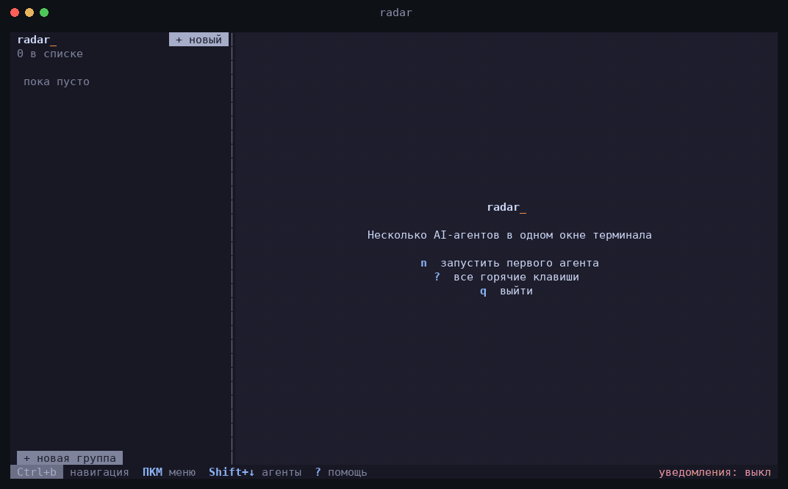

<div align="center">

<picture>
  <source media="(prefers-color-scheme: dark)" srcset="assets/brand/radar-wordmark-on-dark.svg">
  
</picture>

**Many AI agents in one terminal window.**
See who is working, who is done, and who needs your answer.

[](https://github.com/off-art/radar/releases/latest)
[](https://github.com/off-art/radar/actions/workflows/ci.yml)

[](LICENSE)

[Русский](README.md) · English



</div>

Claude Code, Codex, OpenCode, Qwen Code, GigaCode, Gemini CLI and a plain shell live in one window:
a status list on the left, the live terminal of the selected agent on the right. A single Rust binary, no dependencies.

## Why Radar

- **Real-time statuses**: `working` · `waiting` · `ready`. Exact for Claude Code and Qwen Code, via hooks.
- **Notifications** when an agent finishes or needs you (macOS and Linux), with sound.
- **Git at a glance**: branch and `+12 −3` per agent, diff viewer, commit / push / merge without leaving Radar.
- **Agents keep running in the background**: close the window, tasks continue; `radar` reattaches.
- **Answer permission prompts from the list**: `Ctrl+b y`, without entering the agent, always showing the request text.
- **Scriptable**: `radar ctl new / send / wait / read`.

Also: a grid of up to 9 agents, groups, git worktree isolation, an event log, 12 color themes, mouse support and a command palette.

## Install

```sh
curl -fsSL https://raw.githubusercontent.com/off-art/radar/main/install.sh | bash
```

Or with Homebrew (macOS and Linux): `brew install off-art/radar/radar`.

No Rust, no admin rights. Update with `radar update` (for a brew install: `brew upgrade off-art/radar/radar`).
Manual install, Linux and uninstall: [docs/en/install.md](docs/en/install.md).

## Quick start

```sh
radar                        # open the UI, add agents with n
radar ~/work/api claude      # start Claude Code in a folder right away
radar doctor                 # which agents were found
```

Press **`Ctrl+b`** to enter navigation mode (a yellow badge appears at the bottom). Leave it with `Esc`.

| Key | Action |
|---|---|
| `j` / `k` | next / previous agent |
| `n` | new agent |
| `w` | jump to the agent that is waiting for you |
| `y` | approve the agent's permission request |
| `v` | agent's changes (`git diff`) |
| `g` | grid ⇄ single agent |
| `p` | command palette |
| `?` | help |

The mouse works too: click selects an agent, right click opens a menu, selected text is copied to the clipboard.
Full reference: [docs/en/usage.md](docs/en/usage.md).

## Documentation

| Section | Covers |
|---|---|
| [Install](docs/en/install.md) | all methods, Linux, update, uninstall |
| [Using the UI](docs/en/usage.md) | keys, mouse, new-agent form, groups, copying |
| [Git](docs/en/git.md) | branch in the list, diff, commit/push/merge, approvals, event log |
| [Automation](docs/en/automation.md) | `radar ctl`, background sessions |
| [Statuses and notifications](docs/en/integrations.md) | hooks, agent integrations, sound |
| [Settings](docs/en/config.md) | `config.toml`, color themes, limitations |
| [Contributing](CONTRIBUTING.md) | code layout, build, tests |

## Development

```sh
cargo run && cargo test
```

See [CONTRIBUTING.md](CONTRIBUTING.md). Plans live in [ROADMAP.md](ROADMAP.md).

## License

MIT
