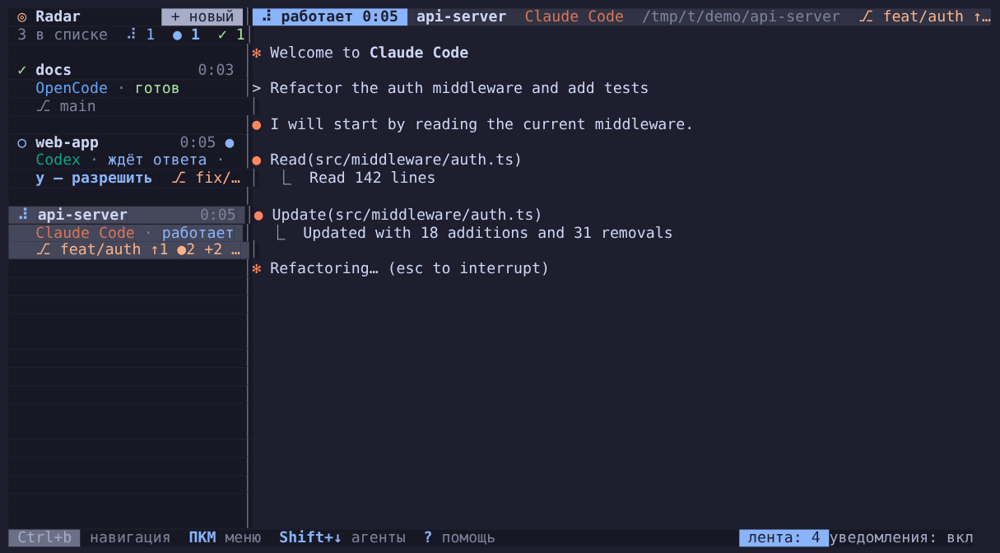
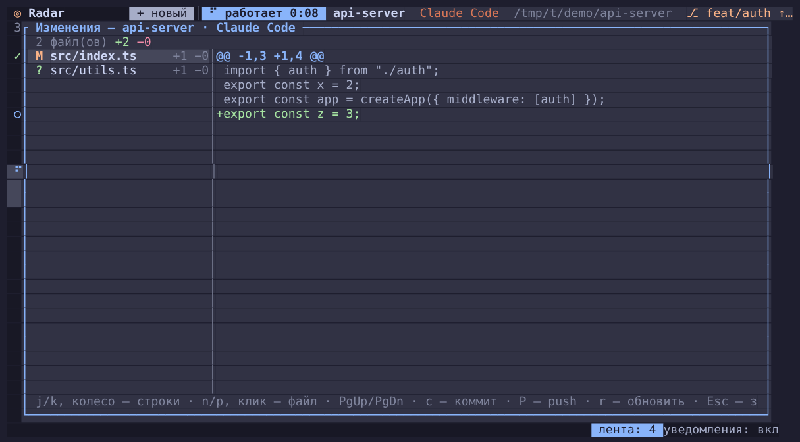
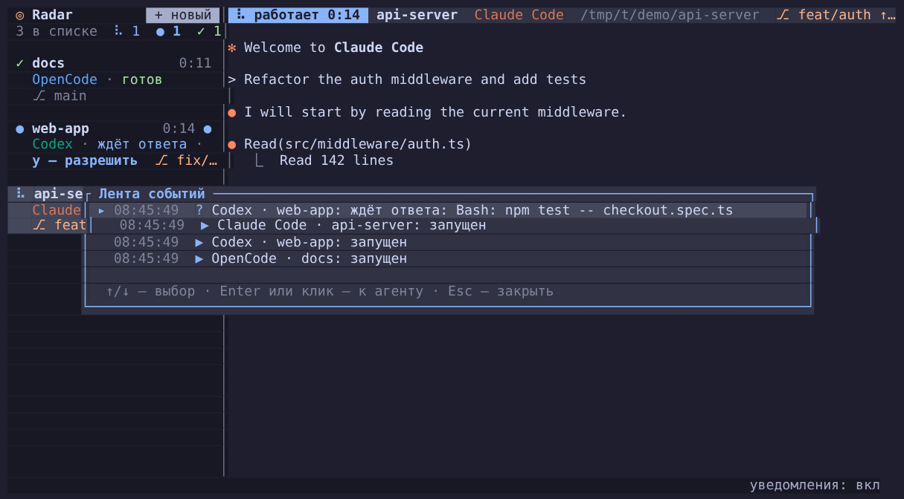
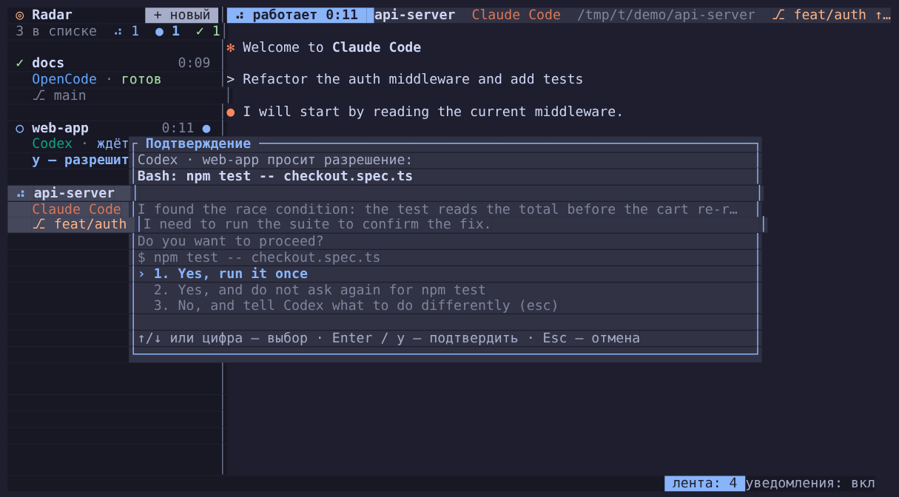
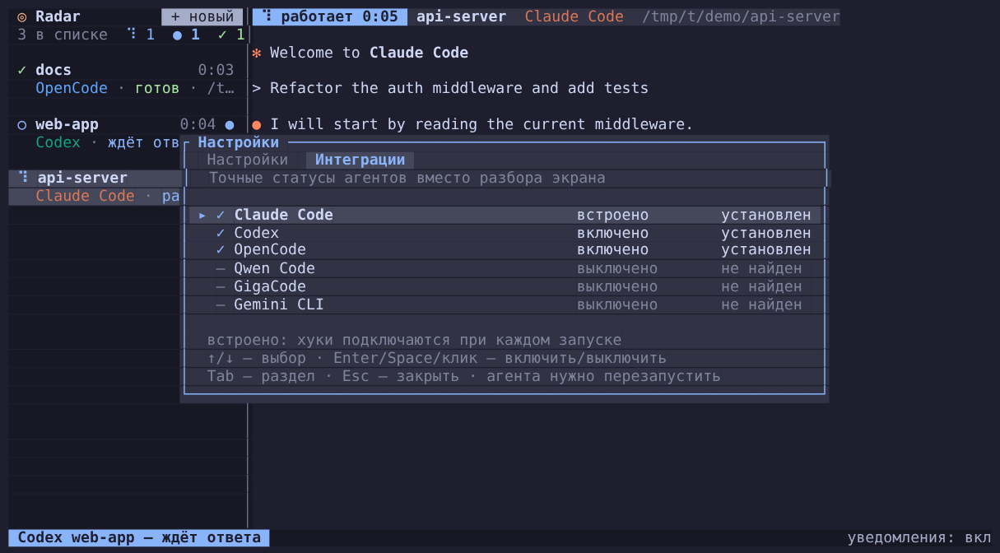

# Radar

Несколько AI-агентов (Claude Code, Codex, OpenCode, Qwen Code, GigaCode, Gemini CLI, shell…) в **одном окне терминала**.
Слева список агентов со статусами, справа — живой терминал выбранного агента. Системное уведомление, когда
агент закончил работу или ждёт вашего подтверждения.



- **Одна команда** — `radar` открывает интерфейс прямо в терминале (на Rust + [Ratatui](https://ratatui.rs), один бинарник без зависимостей).
- **Статусы в реальном времени**: `работает` · `ждёт ответа` · `готов` · `завершён`, таймер, бегущий индикатор в шапке.
- **Уведомления macOS** с иконкой Radar и мягким звуком: «Задача выполнена» и «Нужно подтверждение». Не показываются, если вы прямо сейчас смотрите на этого агента.
- **Git в списке**: у каждого агента ветка, число изменённых файлов и `+добавлено −удалено` (`⎇ feat/auth ●2 +12 −4`), то же в шапке.
- **Просмотр изменений** (`Ctrl+b`, `v`): git diff агента по файлам, с подсветкой, прокруткой и мышью.
- **Лента событий** (`Ctrl+b`, `l`): что произошло с агентами — готов, ждёт ответа, завершён, результаты git.
- **Копирование текста мышью**: протяните мышь по тексту в окне агента — он сразу попадёт в буфер обмена.
- **Сетка** (`Ctrl+b`, `g`) — до 9 агентов на экране одновременно.
- **Изоляция через git worktree** — галочка при создании агента, чтобы несколько агентов не правили одни и те же файлы.
- **Ширина списка** — тяните границу мышью.
- **Группы** — свои группы агентов (в том числе пустые), сворачивание и сводка статусов группы.
- Метка непрочитанного (`●`), переход к агенту, который ждёт ответа (`Ctrl+b`, `w`), прокрутка истории, мышь и контекстные меню (ПКМ), палитра команд.
- **Агенты восстанавливаются** при следующем запуске (Claude Code продолжает диалог).
- **12 цветовых схем** и окно настроек; **интеграции** с агентами для точных статусов (хуки).

## Установка (macOS и Linux)

Не нужны ни brew, ни Rust, ни права администратора — только то, что есть в macOS. Выберите способ.

### Способ 1 — одной командой (рекомендуется)

```sh
curl -fsSL https://raw.githubusercontent.com/off-art/radar/main/install.sh | bash
```

Скрипт скачивает готовый бинарник под ваш процессор (Apple Silicon / Intel) в `~/.local/bin` и подсказывает,
что добавить в `PATH`. Файл, скачанный через `curl`, карантином macOS не помечается.

### Способ 2 — скачать архив вручную (без `curl`-скрипта)

1. Откройте [Releases](https://github.com/off-art/radar/releases/latest) и скачайте архив под свой Mac:
   `radar-aarch64-apple-darwin.tar.gz` (Apple Silicon: M1/M2/M3…) или `radar-x86_64-apple-darwin.tar.gz` (Intel).
   Какой у вас процессор: «» → «Об этом Mac» (или `uname -m`: `arm64` — Apple Silicon, `x86_64` — Intel).
2. Распакуйте и положите в `~/.local/bin`:
   ```sh
   cd ~/Downloads
   tar xzf radar-aarch64-apple-darwin.tar.gz        # имя файла — как у скачанного
   mkdir -p ~/.local/bin && mv radar ~/.local/bin/
   xattr -d com.apple.quarantine ~/.local/bin/radar # снимает карантин браузера
   ```
3. Если `~/.local/bin` нет в `PATH`:
   ```sh
   echo 'export PATH="$HOME/.local/bin:$PATH"' >> ~/.zshrc && source ~/.zshrc
   ```

Такой же архив можно просто переслать коллеге в мессенджере — шаги 2–3 те же. Уже стоит старая версия? См. [Обновление](#обновление).
Без `xattr` macOS пишет, что не может проверить разработчика: тогда *Системные настройки → Конфиденциальность и
безопасность → «Всё равно открыть»*.

### Способ 3 — из исходников

Нужен Rust. Без brew он ставится так:

```sh
curl --proto '=https' --tlsv1.2 -sSf https://sh.rustup.rs | sh     # затем перезапустите терминал
git clone https://github.com/off-art/radar.git                      # или «Code → Download ZIP» и распаковать
cd radar
./install.sh                                                        # соберёт и положит в ~/.local/bin
```

Первая сборка — около двух минут. Альтернатива: `cargo install --path .` (ставит в `~/.cargo/bin`).

### Linux (Debian, СберОС и др.)

Готовые сборки есть для `x86_64` и `aarch64` (glibc 2.35+: Debian 12/13, Ubuntu 22.04+). Проверено на Debian 13 (aarch64, контейнер): установка, `radar update`, фоновые сессии, `radar stop`. Установка и обновление те же:

```sh
curl -fsSL https://raw.githubusercontent.com/off-art/radar/main/install.sh | bash
radar update          # дальше обновляйтесь так
```

Если GitHub с вашей сети недоступен — скачайте архив `radar-x86_64-unknown-linux-gnu.tar.gz` (или `aarch64`) на странице
[Releases](https://github.com/off-art/radar/releases/latest), распакуйте и положите в `~/.local/bin`:

```sh
tar xzf radar-x86_64-unknown-linux-gnu.tar.gz
mkdir -p ~/.local/bin && rm -f ~/.local/bin/radar && mv radar ~/.local/bin/
```

Для уведомлений и звука нужны `libnotify-bin` (`notify-send`) и `pulseaudio-utils` (`paplay`) или `alsa-utils` (`aplay`):
`sudo apt install libnotify-bin pulseaudio-utils`. Проверка: `radar doctor`, `radar notify-test`. Копирование мышью идёт в системный
буфер через `wl-copy` (Wayland) или `xclip`/`xsel` (X11), если они установлены, иначе через OSC 52 (терминал должен его поддерживать).
Из исходников: `sudo apt install build-essential curl git`, затем Rust и `./install.sh`, как в способе 3.

### После установки

```sh
radar update        # обновить до последней версии
radar doctor        # какие агенты найдены (Claude Code, Codex, OpenCode, Qwen Code, GigaCode, Gemini CLI)
radar notify-test   # проверка уведомлений: создаст иконку, проиграет звуки, покажет тестовое уведомление
radar               # запуск
```

При первом уведомлении macOS спросит разрешение для «Radar» — нажмите «Разрешить» (или включите в
*Системные настройки → Уведомления → Radar*).

### Обновление

Настройки (`~/.config/radar/`), сохранённые агенты и интеграции при обновлении остаются. Сначала закройте все окна Radar.

**Любой способ, версия 0.3.1 и новее — одна команда:**

```sh
radar update            # скачает последнюю версию и заменит себя
radar update --check    # только проверить, есть ли новая
```

Если у вас версия 0.3.0 или старше, команды `radar update` ещё нет: обновитесь один раз способом ниже, дальше хватит `radar update`.

**Способ 1 (одной командой)** — повторите команду установки, она заменит бинарник сама.

**Способ 2 (архив вручную):**

1. Скачайте архив нужной версии на странице [Releases](https://github.com/off-art/radar/releases/latest)
   (`aarch64` — Apple Silicon, `x86_64` — Intel).
2. Выполните:
   ```sh
   cd ~/Downloads
   tar xzf radar-aarch64-apple-darwin.tar.gz     # имя — как у скачанного файла
   rm ~/.local/bin/radar                         # сначала удалить старый, не перезаписывать!
   mv radar ~/.local/bin/
   xattr -d com.apple.quarantine ~/.local/bin/radar
   ```
3. Проверьте версию: `radar --version`.

**Способ 3 (из исходников)** — `git pull && cargo build --release`, затем `rm ~/.local/bin/radar && cp target/release/radar ~/.local/bin/radar`.

> На Apple Silicon не копируйте новый бинарник поверх старого командой `cp` — macOS убьёт процесс (`killed`).
> `install.sh` делает это правильно (удаляет, кладёт новый файл, подписывает); вручную: `rm ~/.local/bin/radar`, затем `mv`/`cp`.

### Удаление

```sh
radar stop                          # остановить агентов, работающих в фоне
radar integration uninstall all     # если включали интеграции: убирает хуки Radar из конфигов агентов
rm ~/.local/bin/radar
rm -rf ~/.config/radar ~/.radar     # настройки, список агентов, помощник уведомлений, git-worktree (необязательно)
```

## Использование

```sh
radar                        # открыть интерфейс, агентов добавлять клавишей n
radar ~/work/api claude      # открыть и сразу запустить Claude Code в папке
radar claude claude codex    # три агента в текущей папке
radar ~/work/api gigacode    # GigaCode CLI в папке проекта
```

Управление — **мышью** и **клавишами** (по модели Herdr).

**Мышь**
- `ЛКМ` — выбрать агента, `+ новый` в шапке списка — запустить нового, `уведомления: вкл` внизу — переключатель.
- `ПКМ` (или Ctrl+клик) — контекстное меню: на агенте в списке или в его панели — переименовать, перезапустить,
  выключить уведомления только для него, новый агент в этой папке, закрыть; на пустом месте — новый агент, сетка,
  уведомления, помощь.
- Колесо — прокрутка истории. В `less`/`vim`/`htop` колесо работает как стрелки, а агентам, которые сами включили
  мышь (например OpenCode), события передаются как есть.

**Клавиши.** Нажмите **`Ctrl+b`** один раз — включится *режим навигации* (внизу жёлтая плашка «НАВИГАЦИЯ»).
В нём не нужно ничего зажимать, он остаётся включённым, пока вы не нажмёте `Esc`/`Enter`:

| Клавиша | Действие |
|---|---|
| `j` / `k` (`↓` / `↑`, `Tab`, `(` `)`) | следующий / предыдущий агент (можно жать несколько раз подряд) |
| `1…9` | перейти к агенту по номеру |
| `n` / `N` | новый агент / новый агент того же типа в этой папке |
| `x` | закрыть агента |
| `r` / `R` | переименовать / перезапустить завершившегося |
| `w` | перейти к агенту, который **ждёт ответа** |
| `g` | сетка ⇄ один агент |
| `m` / `M` | тишина для выбранного агента / все уведомления |
| `u` `d` (`[` `]`, `PgUp` `PgDn`) | прокрутка истории |
| `y` | **разрешить запрос** агента, который ждёт ответа (диалог с текстом запроса; подтверждение только клавишей `y`) |
| `l` | **лента событий**: запуск, «закончил за 4:12», «ждёт ответа: Bash: …», завершение, результаты git; `Enter` — к агенту |
| `G` / `a` / `o` | **создать группу** / переместить выбранного агента в группу / свернуть-развернуть его группу |
| `K` / `J` | **переставить** выбранного агента выше / ниже в списке (порядок запоминается). То же — перетаскиванием мышью по списку и в меню ПКМ |
| `v` | **изменения агента** (`git diff`): файлы слева, строки справа; `n`/`p` — файл, `j`/`k` — строки, `r` — обновить |
| `,` | **настройки**: цветовая схема, уведомления, звук, громкость, окошки, ширина списка, восстановление агентов; `Tab` — вкладка «Интеграции» |
| `S` | выбрать звуковую тему (с прослушиванием) |
| `p` или `Space` | **палитра команд** — поиск по действиям и агентам |
| `?` · `q` | помощь · выход |
| `Ctrl+b Ctrl+b` | отправить агенту сам `Ctrl+b` |

Без префикса работают `Shift+↑` / `Shift+↓` (переключение агентов) и `Shift+PgUp` / `Shift+PgDn` (прокрутка) — остальное агентам нужно, поэтому не занято.
Все сочетания меняются в `[keys]` конфига (список действий — в примере `config.toml`): можно сменить префикс (`ctrl+space`, `ctrl+a`…) и добавить свои прямые
сочетания (например `"alt+n" = "new"`).

В формах и полях ввода работает нормальное редактирование: `←/→`, `Home/End`, `Option+←/→`, `Ctrl+a/e/u/k/w`.

Пока агентов нет, клавиши `n`, `p`, `?`, `q` работают без префикса.

**Форма «Новый агент».** Показывает только те агенты, которые установлены у вас (Radar проверяет это в фоне при запуске);
кнопка `+ ещё N (не установлены)` показывает остальные. Агента можно выбрать кликом, `←/→`, цифрой или `a` (показать/скрыть
недоступных); клик по строке «Папка», «Имя» или по галочке worktree переходит к ней. ПКМ на пустом месте тоже содержит
пункты «Новый: <агент>» для каждого установленного агента.

**Подсказка при наборе.** Пока вы печатаете путь, серым показывается первый подходящий вариант (`/tmp/ac/be`**`ta/`**); `→` принимает его целиком. Для `desk` без `~/` подсказка выглядит как `→ ~/Desktop/`.

**Автодополнение папки.** В поле «Папка» `Tab` работает как в шелле: дописывает путь (`~/Desk` → `~/Desktop/`), при нескольких
вариантах — общее начало и список подсказок под полем, ничего не подставляется само: начните печатать и жмите `Tab` ещё раз. Регистр не важен, `~/` можно не писать: `desk` + `Tab` → `~/Desktop/` (сначала ищется в текущей папке, затем в домашней). Скрытые папки (`.git`…) подсказываются,
если начать имя с точки. Между полями формы — `↑`/`↓` или клик.

## Группы

Группы создаёте вы сами — автоматически агенты не группируются. Агенты без группы идут ниже всех групп под подписью «Без группы».

- **Создать** — кнопка `+ новая группа` внизу списка, `Ctrl+b`, `G` или ПКМ по пустому месту → «Новая группа…». В диалоге введите имя и отметьте галочками агентов (`Tab` — переключиться между именем и списком, `Пробел` — отметить, `Enter` — готово). Можно создать **пустую** группу и добавить агентов позже.
- **Добавить агента** — `Ctrl+b`, `a` (или ПКМ по агенту → «В группу…») и выбор группы; либо перетащить агента мышью на заголовок группы или на агента из неё.
- **Переименовать, изменить состав, сдвинуть выше/ниже, удалить** — ПКМ по заголовку группы. При удалении агенты остаются в списке без группы.
- **Свернуть / развернуть** — клик по заголовку или `Ctrl+b`, `o`. В заголовке видна сводка статусов группы: `▾ Бэкенд 3  ⠋ 1 ● 1 ✓ 1` (работают / ждут ответа / готовы).
- `K`/`J` переставляют агента только внутри его группы.

Группы и свёрнутость запоминаются между запусками.

Во всех небольших окнах (подтверждения, диалог группы, переименование, палитра команд, разрешение запроса агента) работают клики: по кнопкам `Enter` / `Esc`, по строкам списков и галочкам; клик мимо окна — отмена.

## Ширина списка

Границу между списком агентов и окном агента можно **потянуть мышью**: ширина запоминается (от 20 колонок, окну агента остаётся не меньше 40). Те же значения по кругу: Настройки → «Ширина списка».

## Git в списке

Вторая строка агента — состояние репозитория в его папке: `⎇ ветка ↑впереди ↓позади ●файлов +строк −строк`
(оранжевым, если есть изменения). Обновляется раз в несколько секунд и сразу после того, как агент закончил работу.
Не git-папки показывают путь. Данные берутся из `git status`/`git diff` в фоновом потоке, интерфейс не тормозит.

## Просмотр изменений (diff)

`Ctrl+b`, затем `v` (или ПКМ на агенте → «Изменения (git diff)…», или палитра) открывает окно с изменениями в папке
выбранного агента относительно последнего коммита: слева файлы (`M` изменён, `A` новый, `D` удалён, `R` переименован,
`?` не в git) со счётчиками `+/−`, справа строки с подсветкой (зелёные добавлены, красные удалены).



Клавиши: `j`/`k` или колесо — строки, `PgUp`/`PgDn`/`Space` — страница, `n`/`p`/`Tab` или клик — другой файл,
`g`/`G` — начало и конец, `r` — перечитать, `Esc` — закрыть. Новые файлы показываются целиком (до 200 КБ), двоичные — пометкой.
Если папка не git-репозиторий или изменений нет, Radar сообщит об этом.

## Действия с git

ПКМ на агенте или палитра (`Ctrl+b`, `p`) — команды выполняются в фоне, результат приходит уведомлением:

- **Закоммитить…** — спросит сообщение и сделает `git add -A && git commit` (в окне изменений — клавиша `c`).
- **Отправить (push)…** — `git push` текущей ветки после подтверждения (в окне изменений — `P`). Пароли не запрашиваются:
  если нужна авторизация, Radar покажет ошибку git, ничего не зависнет.
- **Влить ветку в основную…** (только для агентов с worktree) — `merge --no-ff` в основной репозиторий; при конфликте слияние откатывается.
- **Удалить worktree…** — закрывает агента, удаляет worktree и ветку (ветка — только если уже влита).

Опасные действия всегда идут через диалог подтверждения. Для своих сочетаний есть действия `git_commit`, `git_push`,
`git_merge`, `git_remove_worktree` в `[keys]`.

## Лента событий



`Ctrl+b`, затем `l` (или ПКМ → «Лента событий…», или палитра) показывает последние 200 событий: когда агент запущен,
закончил работу (с длительностью), ждёт ответа (с текстом запроса, если агент его сообщил), завершился, и результаты git-действий.
Новые строки сверху; `↑`/`↓` — выбор, `Enter` или клик — перейти к агенту. Пока в ленте есть непросмотренное, в статус-строке
горит «лента: N». Лента хранится только в памяти и очищается при выходе из Radar.

## Разрешение запросов из списка



Когда агент остановился с вопросом «разрешить выполнить команду?», ответить можно, не заходя в него:

- `Ctrl+b`, затем `y` — Radar берёт выбранного агента, а если тот не ждёт, ближайшего ждущего (запросы есть и в палитре
  «Разрешить: …», и в меню ПКМ на пустом месте);
- клик по строке «ждёт ответа» в списке или в шапке; в строке ждущего агента горит «y — разрешить».

Диалог показывает, что именно просит агент (`Bash: rm -rf build`), и сам вопрос с вариантами так, как они видны на экране агента
(`1. Yes, allow once`, `2. Always allow…`, `4. No`). Выбор — `↑`/`↓` (или цифра), подтверждение — `Enter` или `y`; Radar сам
отправит агенту нужное число стрелок и Enter, так что можно ответить любым вариантом, а не только «разрешить один раз».
Любая другая клавиша (`Esc`) — отмена. Если запрос изменился, пока диалог был открыт, Radar ничего не отправит.
Изначально выбран тот вариант, который агент выделил сам.

Работает для Claude Code и Qwen Code (нужен текст запроса из хуков: для Qwen — включённая интеграция; выбор варианта стрелками —
там, где «разрешить» это `Enter`). Для остальных агентов включается в `config.toml`: `approve = "y"` (или `"enter"`, `"1"`; пустая строка — выключить). Какая именно клавиша разрешает —
зависит от агента, поэтому включайте только проверенное.

## Копирование текста

Протяните мышь с нажатой левой кнопкой по тексту в окне агента: выделение подсвечивается, а после отпускания кнопки текст
сразу копируется в буфер обмена (на macOS через `pbcopy`, иначе — через OSC 52). Внизу появится «Скопировано: N симв.».
Выделение работает и там, где агент сам ловит мышь (Qwen Code, OpenCode), и снимается любой клавишей, кликом или прокруткой.
Обычный клик по-прежнему уходит агенту (раскрыть блок, нажать кнопку). Выделение линейное, как в терминале: от начала до конца
протянутого фрагмента, а рамки агента (`│`) попадают в копию вместе с текстом.

Если выделение ещё на экране, правый клик открывает меню с пунктом «Копировать» — копирует выделенное повторно.

Выделение можно выключить: `Ctrl+b ,` → «Выделение мышью (копирование)» или `mouse_select = false` в `config.toml` —
тогда мышь целиком уходит агенту, как раньше (нужно агентам, которые сами используют перетаскивание: vim, mc). Если выключить
мышь совсем (`mouse = false`), работает родное выделение терминала. Выделить текст «в обход» Radar можно и при включённой мыши: с зажатым Option (iTerm2)
или Fn (Terminal.app) — но так выделится и содержимое списка агентов.

## Управление из скриптов (`radar ctl`)

Пока Radar открыт в одном окне, им можно управлять из другого терминала или скрипта:

```sh
radar ctl list [--json]                       # агенты, статусы, ветки
radar ctl new claude ~/proj/api --name api    # запустить агента (--worktree — в отдельном worktree)
radar ctl send api "прогони тесты и почини"   # отправить текст и Enter (--no-enter — без Enter, «-» — из stdin)
radar ctl status api [--json]                 # starting / working / waiting / idle / exited
radar ctl read api --lines 30                 # последние строки экрана агента
radar ctl wait api --timeout 600              # ждать, пока агент закончит
radar ctl close api
```

Агента можно указать номером (из `list`), именем или началом имени. `wait` завершается кодом `0` (готов),
`3` (ждёт ответа), `4` (завершён) или `124` (время вышло); чтобы не поймать старое состояние сразу после `send`,
он ждёт, пока агент простоит спокойно `--settle` секунд (по умолчанию 1,5). Пример: поднять двух агентов и дождаться обоих:

```sh
radar ctl new claude . --name review && radar ctl send review "сделай ревью последнего коммита"
radar ctl new claude . --name tests  && radar ctl send tests  "допиши тесты для src/auth"
radar ctl wait review; radar ctl wait tests; radar ctl read review --lines 40
```

Команды идут через unix-сокет Radar с правами только владельца (`0600`). Если открыто несколько окон Radar, берётся
последнее; точнее — `--sock ПУТЬ`. Внутри агента, запущенного в Radar, переменная `RADAR_SOCK` уже указывает на «своё» окно.

## Фоновые сессии

Каждый агент работает в собственном фоновом процессе (`radar host`), а окно Radar лишь подключается к нему.
**Закрыли Radar (`q`) — агенты продолжают работать**: идут задачи, держатся диалоги, не пропадают переменные
шелла и фоновые команды. Запустили `radar` снова — окно подключается к ним обратно, с тем же экраном и состоянием.

- Агент закрывается, когда вы сами его закрываете (`Ctrl+b`, `x`), когда он завершился сам, либо командой
  **`radar stop`** (останавливает всех фоновых агентов). `Ctrl+b`, `Q` — остановить всех и выйти из Radar.
- Хуки и интеграции продолжают работать: события идут через процесс агента и доходят до окна после подключения.
- Один агент показывается одному окну: если открыть второй Radar, он покажет только своих агентов и предупредит,
  что остальные открыты в другом окне.
- `radar ctl` управляет окном; чтобы увидеть, что работает в фоне без окна, откройте `radar`.
- При подключении восстанавливается видимый экран; прокрутка истории, накопленная до закрытия окна, не сохраняется.
- Если Mac перезагружали или процессы агентов были убиты, Radar по сохранённому списку (`sessions.toml`) поднимает
  агентов заново, а **Claude Code продолжает прежний диалог** (`claude --resume`), остальные начинают с чистого листа.
  Если запустить `radar <агент>` с аргументами, это восстановление пропускается. Отключить: Настройки →
  «Восстанавливать агентов» или `restore = false` в `config.toml`.

## Как определяются статусы

- **Claude Code — точно, через хуки.** Radar запускает `claude --settings ~/.config/radar/claude-settings.json`.
  Хуки (`UserPromptSubmit`, `PreToolUse`, `Notification`, `Stop`…) вызывают `radar hook <событие>`, которая
  сообщает интерфейс через unix-сокет. Ваши глобальные настройки и хуки Claude Code не затрагиваются.
  Хуки — отдельные процессы и иногда приходят не по порядку или теряются, поэтому есть предохранитель: если по хукам агент «работает»,
  а его экран молчит 6 секунд и подсказки `esc to interrupt` нет, Radar считает, что агент закончил (и присылает уведомление).
- **Остальные агенты — по эвристике** (по экрану агента и активности вывода):
  - есть подсказка вроде `esc to interrupt` или вывод идёт → `работает`;
  - на экране вопрос (`(y/n)`, `Do you want to proceed?`, `Allow once`, …) и вывод затих → `ждёт ответа`;
  - вывод молчит больше 2 секунд → `готов`.

  Эвристика универсальна, но не идеальна: если ваш агент пишет подтверждения иначе, добавьте фразу в `src/status.rs`
  (списки `WAITING` и `WORKING`) — это пара строк.

### Интеграции



Для остальных агентов точные статусы можно включить так же, как у Claude Code, — через хуки. Откройте
**Настройки → вкладка «Интеграции»** (`,` в режиме навигации, затем `Tab`; или ПКМ → «Интеграции агентов…»):
`✓` — включено, `–` — выключено, справа видно, установлен ли агент. `Enter`/`Space`/клик включает и выключает.
То же из терминала:

```bash
radar integration                      # список и состояние
radar integration install qwen         # включить (или all)
radar integration uninstall qwen       # выключить
```

| Агент | Что правится |
|---|---|
| Claude Code | ничего — встроено, всегда включено |
| Qwen Code | `~/.qwen/settings.json` (хуки) — **проверено** на Qwen Code 0.25: работает → ждёт разрешения (что именно просит, видно в списке) → готов |
| GigaCode | `~/.gigacode/settings.json` (хуки; форк Qwen Code, ожидается то же поведение — **не проверено**, папку настроек уточните) |
| Gemini CLI | `~/.gemini/settings.json` (хуки) |
| Codex | `~/.codex/hooks.json` (хуки) |
| OpenCode | плагин `~/.config/opencode/plugins/radar.js` |

Правки обратимы: записи Radar помечены именем `radar`, остальной конфиг не трогается, перед первой правкой
рядом сохраняется `*.radar-backup`. Если в файле комментарии или он не разбирается как JSON — Radar его не изменит.
Вне Radar эти хуки ничего не делают. Уже запущенным агентам нужен перезапуск. Без интеграции работает эвристика.

**Отладка интеграций.** `RADAR_HOOK_LOG=1 radar` пишет все события хуков (агент, событие, данные) в
`~/.config/radar/hooks.log` — `tail -f` покажет, что реально присылает агент. Если после включения интеграции статусы
не точные, пришлите этот журнал.

## Уведомления

Уведомление приходит от приложения **Radar** с иконкой радара: при первом запуске Radar сам создаёт крошечный
помощник `~/.config/radar/Radar.app` (нужны только штатные `osacompile`/`codesign` из macOS). Звук — свои мягкие
колокольчики вместо системного «Glass»: один для «готово», другой (чуть ниже) для «нужно подтверждение».
Звук и всплывающие окошки включаются **независимо**: `popups = false` оставит только звук, `sound = false` — только окошки.
Звуковых тем семь: `bell`, `sonar`, `retro`, `harp`, `knock`, `thump`, `drop`. Выбрать (с прослушиванием) можно прямо в
интерфейсе: `Ctrl+b`, `S` (или ПКМ на пустом месте → «Выбрать звук…»); там же переключатели звука и окошек.
Выбор из интерфейса запоминается в `~/.config/radar/state.toml` и важнее `config.toml`.
Громкость — `volume`, тема по умолчанию — `sound_theme`, свои файлы — `sound_done` / `sound_waiting`.

Проверка: **`radar notify-test`** — создаст помощник, проиграет оба звука и покажет тестовое уведомление.
При первом показе macOS спросит разрешение для «Radar» (или включите в *Системные настройки → Уведомления → Radar*).
Если помощник создать не удалось, Radar автоматически показывает обычные уведомления через `osascript`.

Уведомление не показывается, если окно терминала в фокусе и вы смотрите именно на этого агента.
Отдельному агенту можно выключить уведомления через ПКМ → «Выключить уведомления агента» (значок `⊘` в списке).

## Настройки и цветовые схемы

`Ctrl+b`, затем `,` (или ПКМ на пустом месте → «Настройки…») открывает окно настроек: цветовая схема, уведомления,
звук и его тема, громкость, всплывающие окошки, ширина списка, восстановление агентов. Значения меняются стрелками
или кликом и сразу применяются; всё запоминается в `~/.config/radar/state.toml`. Вкладка «Интеграции» — по `Tab`
(см. выше).

Цветовые схемы (по образцу Herdr): `radar` (по умолчанию, фон вашего терминала), `terminal` (цвета палитры вашего
терминала), `catppuccin`, `catppuccin-latte`, `tokyo-night`, `tokyo-night-day`, `gruvbox`, `dracula`, `nord`,
`one-dark`, `solarized-dark`, `solarized-light`. Кроме `radar` и `terminal`, схема закрашивает фон и подменяет
16 базовых цветов ANSI в окнах агентов, так что `ls`, `git diff` и прочий цветной вывод выглядят в тон.

Свои цвета поверх выбранной схемы (hex, `rgb(r,g,b)` или имя цвета):

```toml
[theme]
name = "catppuccin"

[theme.custom]
accent = "#a6e3a1"
sidebar_bg = "#181825"
```

Токены: `accent`, `panel_bg`, `sidebar_bg`, `header_bg`, `active_row_bg`, `text`, `subtext0`, `overlay0`, `overlay1`,
`green`, `yellow`, `red`, `blue`, `teal`, `peach`, `mauve`. Автопереключение светлой/тёмной схемы по теме системы
пока не поддерживается.

## Конфиг

`~/.config/radar/config.toml` (пример создаётся при первом запуске):

```toml
notifications = true
sound = true
popups = true         # всплывающие уведомления (звук от них не зависит)
restore = true        # восстанавливать список агентов при запуске
sidebar_width = 0     # ширина списка агентов, 0 — автоматически (можно тянуть мышью за границу)
scrollback = 5000     # глубина прокрутки назад, строк на агента (≈15 МБ на агента при 100 колонках)
sound_theme = "bell"  # bell, sonar, retro, harp, knock, thump, drop
volume = 0.6          # громкость уведомлений, 0.0–1.0
mouse = true          # false — родное выделение терминала вместо выделения Radar (см. «Копирование текста»)

[theme]
name = "radar"        # см. раздел «Настройки и цветовые схемы»; свои цвета — [theme.custom]

[keys]
prefix = "ctrl+b"     # префикс режима навигации; свои сочетания — [keys.direct]

# Свои агенты или переопределение встроенных (по имени)
[[agent]]
name = "Claude Code"
command = "claude"
args = ["--model", "opus"]
kind = "claude"       # claude — статусы через хуки, generic — эвристика, shell — обычный shell
color = "#d97757"

[[agent]]
name = "Aider"
command = "aider"
color = "#22c55e"
```

Другой путь к конфигу: переменная `RADAR_CONFIG`. Что меняется из интерфейса (тема, звук, громкость, ширина списка,
восстановление), хранится в `state.toml` и важнее `config.toml`; список агентов — в `sessions.toml`.
Справка по командам: `radar --help`.

## Ограничения

- **Агенты живут, пока открыт Radar.** При выходе процессы останавливаются; при следующем запуске список
  восстанавливается (см. выше), но не-Claude агенты стартуют с чистого листа, а долгая задача при закрытом Radar не
  продолжится. Режим «отсоединиться и вернуться потом», как в tmux, — в планах (клиент-сервер).
- Интеграции: хуки GigaCode и Codex сделаны по документации Qwen Code / Codex и не проверены на реальных агентах.
- Автопереключение светлой/тёмной схемы по теме системы не поддерживается.
- Эвристика статусов для не-Claude агентов может ошибаться на нестандартных формулировках.
- Протестировано на Linux; сборка и тесты на macOS — в CI (`.github/workflows/ci.yml`).

## Разработка

```sh
cargo run                 # запуск
cargo test                # тесты
cargo build --release     # релизная сборка → target/release/radar
```

Перед коммитом: `cargo fmt && cargo clippy --all-targets -- -D warnings && cargo test` (то же проверяет CI).

Структура `src/`:

- `main.rs` — точка входа и подкоманды (`host`, `hook`, `ctl`, `doctor`, `integration`, …), `ctl.rs` — клиент `radar ctl`, `groups.rs` — модель групп;
- `app/` — состояние и события окна: `mod.rs` (типы и `App`), `run.rs` (главный цикл), `sessions.rs`, `groups.rs`,
  `layout.rs`, `attention.rs` (статусы, тики, уведомления), `keys.rs`, `mouse.rs`, `actions.rs`, `settings.rs`,
  `git_actions.rs`, `views.rs`, `approve.rs`, `remote.rs` (`radar ctl`);
- `ui/` — отрисовка (ratatui): `sidebar`, `panes`, `statusbar`, `popup`, `form`, `overlays`, `settings`, `diff`;
- `session.rs` — pty и конечный автомат статусов, `status.rs` — эвристика, `host.rs` — фоновый хозяин агента;
- `hook.rs`, `integrations.rs` — хуки и плагины агентов; `events.rs` — журнал событий;
- `git.rs`, `gitops.rs`, `diff.rs` — git (запуск с таймаутом, наблюдатель, worktree, коммит/push, diff);
- `config.rs`, `persist.rs`, `paths.rs` — настройки, сохранённый список агентов, каталоги;
- `theme.rs`, `keys.rs`, `input.rs`, `menu.rs`, `textfield.rs`, `complete.rs`, `notify.rs`, `clipboard.rs`, `update.rs`,
  `sync.rs` (мьютексы без паники), `testutil.rs` (помощники тестов);
- `assets/` — иконка и звуки (`python3 assets/gen_sounds.py` пересоздаёт звуки).

## Лицензия

MIT
